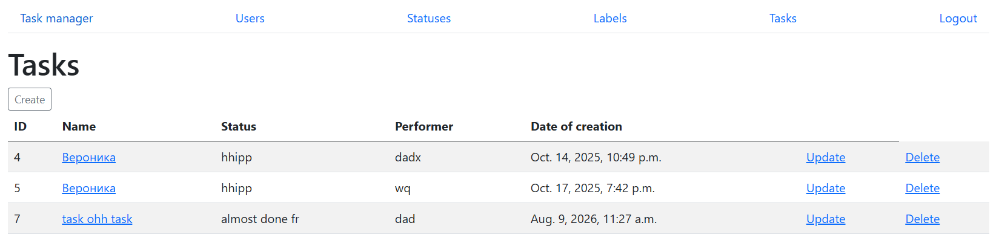
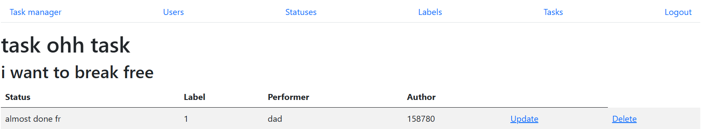
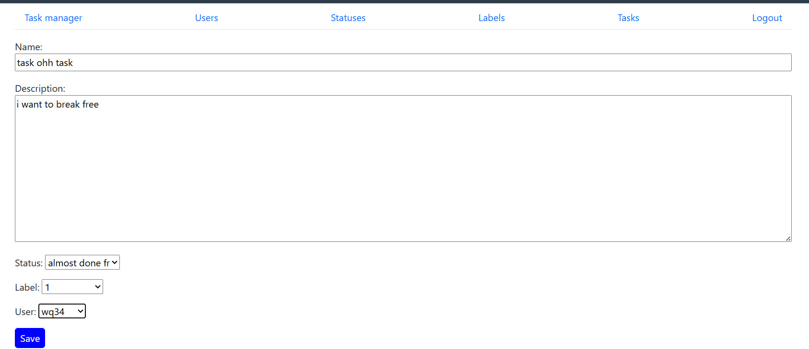
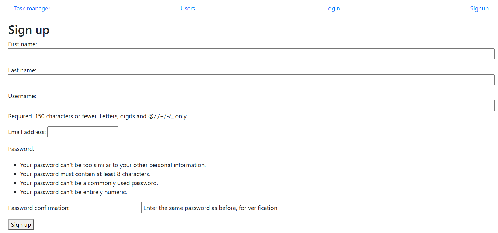
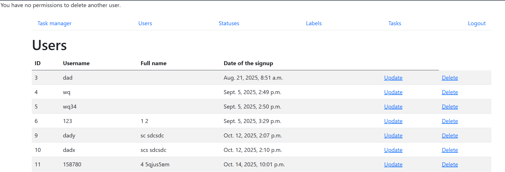

Task Manager
Веб-приложение для управления задачами, пользователями, статусами и метками.
Проект выполнен в рамках изучения Django и представляет собой полноценное CRUD-приложение с авторизацией пользователей и разграничением доступа к действиям.

Возможности
Пользователи:
-регистрация нового пользователя;
-авторизация и выход из аккаунта;
-просмотр списка пользователей;
-редактирование собственного профиля;
-изменение пароля;
-удаление собственного аккаунта;
-запрет на изменение и удаление чужих аккаунтов.
Задачи:
-просмотр списка задач;
-просмотр отдельной задачи;
-создание задачи;
-редактирование задачи;
-удаление задачи;
-привязка задачи к пользователю, статусу и метке;
-запрет на удаление чужих задач.
Статусы:
-создание, редактирование и удаление статусов для задач;
-запрет на удаление использующихся в настоящий момент статусов.
Метки:
-создание, редактирование и удаление меток для задач;
-запрет на удаление использующихся в настоящий момент меток.

Технологии
Python 3.10+
Django 5.2.5
SQLite
Bootstrap 5 (подключается через CDN, поэтому отдельная Python-библиотека django-bootstrap5 для запуска проекта не требуется)
HTML / CSS
Django Templates

Структура проекта
Основная логика приложения находится в hexlet-code/task_manager/:
task_manager/
├── label/        # работа с метками
├── statuses/     # работа со статусами
├── task/         # работа с задачами
├── user/         # пользователи и авторизация
├── templates/    # HTML-шаблоны
├── settings.py   # настройки Django
└── urls.py       # маршрутизация
Модели приложения связаны между собой через внешние ключи. Например, задача связана с пользователем, статусом и меткой.

Запуск проекта
1. Клонировать репозиторий
git clone https://github.com/Sinitsa-11/python-django-development-project-52.git
cd python-django-development-project-52
2. Создать виртуальное окружение
Windows:
python -m venv .venv
.venv\Scripts\activate
Linux / macOS:
python3 -m venv .venv
source .venv/bin/activate
3. Установить зависимости
pip install -r requirements.txt
4. Перейти в директорию приложения
cd hexlet-code
5. Применить миграции
python manage.py migrate
6. Запустить сервер
python manage.py runserver
После запуска приложение будет доступно по адресу:
http://127.0.0.1:8000/

Что было реализовано
- CRUD-операции для задач, пользователей, статусов и меток;
- назначение исполнителя для задач;
- модели и связи между ними;
- Django ORM;
- формы и валидация данных;
- class-based views;
- маршрутизация;
- шаблоны Django;
- регистрация, аутентификация и выход пользователей;
- разграничение прав доступа;
- безопасное хранение паролей средствами Django;
- работа с сессиями;
- сообщения пользователю через Django Messages;
- миграции базы данных;
- автоматические проверки проекта через GitHub Actions.
Отдельное внимание уделено взаимодействию моделей и проверке прав доступа. Например, пользователь не может удалить чужую задачу. Также статус или метка не могут быть удалены, если они используются существующими задачами.

Автоматические проверки
Для проекта настроена автоматическая проверка через GitHub Actions.
При обновлении репозитория запускаются проверки Hexlet:
- тесты;
- проверка качества кода и соответствия требованиям линтера.

Интерфейс
Для оформления страниц используется Bootstrap 5. Основная часть интерфейса реализована через Django Templates.
Страница со списком задач: 
Страница отдельной задачи: 
Создание/редактирование задачи: 
Регистрация пользователя: 
Страница со списком пользователей после попытки удалить другого пользователя: 

О проекте
Это учебный проект, созданный в процессе изучения Django.
При разработке я последовательно работала с моделями, представлениями, формами, шаблонами и системой авторизации, а также разбиралась с тем, как организовать связи между несколькими частями приложения.
Проект стал практикой в создании серверного веб-приложения на Python и Django от структуры базы данных до пользовательского интерфейса.

Автор
Синицына Вероника
GitHub: https://github.com/Sinitsa-11

